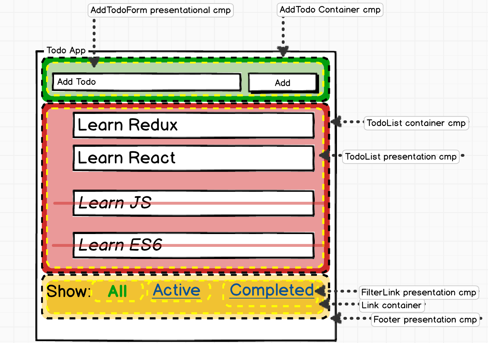

# Styling Components in React

## Learning Objectives

- Review the different ways we can style a React app (CSS or CSS-in-JS).
- Discuss the benefits and drawbacks of both approaches.
- Show examples of the preferred standard for CSS-in-JS, `styled-components` library.

## Framing (15 min / 0:15)

In this lesson, we will be looking at how components are styled within a React
application. We will compare and contrast the different approaches available to React developers, which include:

- using a global CSS, like other projects
- attaching a CSS file to an individual component
- putting our styles directly into a React JS file directly
- using the `styled-components` library to create styled components' template literal pattern

Let's review **components** quickly, just to make sure we're on the same page.

## Components

Think back to F.I.R.S.T. principles of components. Components are:

- **focused**,
- **independent**,
- **reusable**,
- **small**, and
- **testable**.

We design components to do as little as possible (_small_, _focused_) with a
minimal amount of dependence on other components (_independence_, _reusable_).

While components should be independent, we still need them to talk to each other
by passing data. However, to keep components small and focused, we pass only the
data that is _specific to that component's purpose_. Data that is passed into
one component by a parent component (or the application root), we refer to as
`props`.

Lets take a look at two components.

```jsx
// HelloContainer.js
import Hello from "./Hello.js"

class HelloContainer extends Component {
  render() {
    return <Hello name={"Nick"} age={24} />
  }
}
```

```js
// Hello.js
// name and age are immutable inside this component
class Hello extends Component {
  render() {
    return (
      <div>
        <h1>Hello {this.props.name}</h1>
        <p>You are {this.props.age} years old</p>
      </div>
    )
  }
}
```

Here we are passing values, `"Nick"` and `24` into our first `Hello` component
in `HelloContainer.js`, where we are **composing** `Hello` with the JSX
expression, `<Hello name={"Nick"} age={24} />`.

Any values that we pass into a component are called `props`. Inside of the
component we refer to them as `this.props`

Props are one of the things that make React so powerful and help us make
**independent** and **reusable** components. We can pass different data to our
`Hello` component and easily get the same html and css but with different data:

**Any javascript type can be passed as a prop**. This means primitives, objects,
arrays, and even functions are all passable.

```jsx

// HelloContainer.js
const jimmy = {
  name: "Jimmy",
  age: 32
}

const james = "jimmy"
const jamesAge = 29

const jimmyJames = ['jimbo']

const helloJimmy = () => {
  console.log('hello')
}

class HelloContainer extends Component {
  render() {
    <Hello name={"Nick"} age={24} />
    <Hello name={jimmyJames[0]} age={30} />
    <Hello name={james} age={jamesAge} />
    <Hello name={jimmy.name} age={jimmy.age} />
    <Hello name={helloJimmy} />
  }
}
```

We cannot change the values of received `props` inside a component - they are
**immutable**.

```js
// DONT DO THIS EVER

class Hello extends Component {
  render() {
    this.props.name = "not_jimmy"

    return (
      <div>
        <h1>Hello {this.props.name}</h1>
        <p>You are {this.props.age} years old</p>
      </div>
    )
  }
}
```

So what do we do with data we want to control from within a component?

## State (10 min / 0:25)

The limitation of props is that we can't change the data from within the
component. The data that we can change within a component is called
**[state](https://facebook.github.io/react/docs/state-and-lifecycle.html)**. We
haven't talked about state much, but you have worked with it before. Your
project 1 all tracked some state, regardless of which game you built:

- **Trivia**: what is the current score, what card is currently displayed to the
  user, is the user's input correct or incorrect?
- **Simon**: what order of buttons did the user push, what is the order of
  buttons they were supposed to push, what round or level are they on?
- **Tower of Hanoi**: how many discs are in each tower, how many moves has the
  user made?

We can figure out the `state` of a turn-based game because there is a clear idea
of a beginning and end and states that reflect progress from one turn to the
next turn: what flash card is the user on, what buttons do they need to push,
how are the discs distributed among the three towers.

<details>
  <summary>Q: So we know an application can have different states. But how do we transition in between them?</summary>

> A: Events! (or user actions/input)

</details>

### F.I.R.S.T. Principles and State

The aim of the F.I.R.S.T. principles is to create a sane approach to breaking
down not just a user-interface, but also an application's data so it is
easy-to-manage chunks of data and the components that render them.

_Each component is concerned only with the data relevant to its purpose_.

For your first project, you had to do that manually. Manually write event
listeners that would update state stored in global scope and then update your UI
by manually updating individual DOM nodes.

You can think of React as an event-driven state machine, or a machine that
churns out new states as a result of user interactions. A React application
receives input through user interactions (event listeners) and outputs a UI that
reflects a brand new state (new cards, higher score, etc).

We tell React **how we want something to look**, and react does the work to
update it for us. This is sometimes called `declarative` programming. This is in
contrast to `imperative` programing, where we tell our code **what to do**.

### So what is a React component's "state"?

Each component has its own state. We define a component's state as a plain old
javascript object in the constructor.

```jsx
class StatefulExample extends Component {
  constructor() {
    super()
    this.state = {
      examples: ["state is great", "state is fun"],
      cool: true
    }
  }

  render() {
    return (
      <div>
        <p>React is cool, right? {this.state.cool}</p>
        <ul>
          {this.state.examples.map(example => (
            <li>{example}</li>
          ))}
        </ul>
      </div>
    )
  }
}
```

The above code should output this:

```html
<div>
  <p>React is cool, right? true</p>
  <ul>
    <li>state is great</li>
    <li>state is fun</li>
  </ul>
</div>
```

State works just like any old javascript object. The only difference is that
it's a variable called `this.state`, and its defined in the component's
constructor.

### State and Rendering

Before moving on to build our application, it's worth mentioning another aspect
of component `state`: our components re-render when it changes:


Our UI gets updated when state changes. The user takes some action, like
submitting information via a form, and the component holding that form has a
`state` that is updated with the value of the user's input.

Previously we had to manage the relationship between what we saw on the page
(UI) and what state our program was in. So if we updated the score, we also had
to change the displayed score in the DOM. React does this automatically, as long
as we wire up our state correctly.

## Check for Understanding (10 min / 0:35)

- What is the difference between `state` and `props`?
- What do we use `props` for?
- What do we use `state` for?

We've done a fair amount of framing so far, so let's dive in to building our
application!

<details>
<summary>Solution</summary>
<ul>
  <li> State is mutable and Props are designed to be passed to and from components and allows you to share information</li>
  <li> Props allow us to pass data from one independent component to another, and can be used to compose instances from our reusable components.</li>
  <li> State stores information that is specific to a component and that you don't intend to change</li>
</ul>
</details>

## Exercise: React Counters (5 min / 0:40)

For this exercise, we are going to build a React app from scratch that will
serve as an [Abacus](https://en.wikipedia.org/wiki/Abacus) of sorts.

Go ahead and clone
[React Counters](https://git.generalassemb.ly/dc-wdi-react-redux/react-counters)
now. This will be the code we start with.

Take a look at the
[deployed version of the application](http://react-counter.surge.sh/) for
reference.

```bash
git clone git@git.generalassemb.ly:dc-wdi-react-redux/react-counters.git
cd react-counters
git checkout starter
npm install
npm start
```

### You Do: Identify Components (10 min / 0:50)

> 5 minutes exercise. 5 minutes review.

Today we'll work through the 5 stages of the excellently written guide called
[_Thinking in React_](https://reactjs.org/docs/thinking-in-react.html).

Based on step 1,
[break the ui into a component hierarchy](https://reactjs.org/docs/thinking-in-react.html#step-1-break-the-ui-into-a-component-hierarchy),
we'll identify what components we need to build and where they'll go.

Look at the
[deployed version of the application](http://react-counter.surge.sh/) and answer
the following questions:

- How many components does this application have?
- What components is this application built of?

### Components

<details>
  <summary><strong>Open to see the components</strong></summary>


Here we've identified four components on the home page:

1. The top level component, which we'll call `App`, is boxed in red
2. The header component, a sub-component of `App`, is boxed in purple. We'll
   call it `Header`
3. The list of counters, also a sub-component of `App`, is boxed in blue. We'll
   called it `CounterList`
4. An individual container, a sub-component of `CounterList`, is boxed in green.
   We'll call it `Counter`

</details>

<details>
  <summary><strong>Open to see component hierarchy</strong></summary>

  <h4>Component Hierarchy</h4>

Given these breakdowns we have a component hierarchy that looks like this:

- `App`
  - `Header`
  - `CounterList`
    - `Counter`

</details>

### Sample Data

In the final application, we'll be able to use the two buttons in the header to
increase and decrease the number of individual counters on the page. However, to
start, we're going to feed the number of counters into the application as
hard-coded data.

The below Javascript is in our `index.js` file.

```js
const data = {
  counters: 5
}
```

## Building a Static Version of the App (25 min / 1:15)

> 25 minutes exercise / 15 minutes review.

Part 2 calls for us to
[build a static version](https://facebook.github.io/react/docs/thinking-in-react.html#step-2-build-a-static-version-in-react)
of the app, which means passing all of our data by `props`. This makes it much
easier to avoid getting bogged down in tricky details of functionality while
implementing the visual appearance of the UI.

### You Do: Set Up the `App` Component and `index.js`

> 5 minutes exercise / 5 minute review

Try to get it so that your `App` component displays the number of counters
underneath the `Header` component (provided in the starter code).

<details>
  <summary>Solution</summary>

```js
// index.js
import React from "react"
import ReactDOM from "react-dom"
import "./index.css"
import App from "./App"

const data = {
  counters: 5
}

ReactDOM.render(<App data={data} />, document.getElementById("root"))
```

```js
// App.js
import React, { Component } from "react"
import Header from "./Header"

class App extends Component {
  render() {
    return (
      <div className="App">
        <Header />
        <h4>{this.props.data.counters}</h4>
      </div>
    )
  }
}

export default App
```

</details>

### We Do: Set Up the `CounterList` and `Counter` Components

> 10 minutes exercise / 5 minute review

Create a `CounterList` component. It should take the number of counters, passed
down as a prop called `counters` from `App.js`

In `App.js`, render the `CounterList` component.

Using that prop, render that many `Counter` components.

Now create a `Counter` component. It should render `"Counter: 0"` inside of an
`<h4>`, and two buttons (one for incrementing and one for decrementing).

**Tip:** Use this example for the next 'You Do'. You can render an array of
components! It looks something like this:

```jsx
class CounterList extends Component {
  render() {
    //you can use regular javascript right next to HTML thanks to JSX
    let list = []
    for (let i = 0; i < 3; i++) {
      list.push(<SomeComponent />)
    }
    // list will now have 3 `SomeComponent` components in side of it

    // now we can just render the list variable and it will show the 3 components
    return <div className="list">{list}</div>
  }
}
```

<details>
  <summary>Solution</summary>

```js
// Counter.js
import React, { Component } from "react"

class Counter extends Component {
  render() {
    return (
      <div className="Counter">
        <h4>Counter: 0</h4>
        <button>Decrement</button>
        <button>Increment</button>
      </div>
    )
  }
}

export default Counter
```

```js
// CounterList.js
import React, { Component } from "react"
import Counter from "./Counter"

class CounterList extends Component {
  render() {
    let counters = []
    for (let i = 0; i < this.props.counters; i++) {
      counters.push(<Counter />)
    }
    return <div className="Counter-row">{counters}</div>
  }
}

export default CounterList
```

`App.js:`

```diff
import React, { Component } from "react"
import Header from "./Header"
+import CounterList from "./CounterList"

class App extends Component {
  render() {
    return (
      <div className="App">
        <Header />
+       <CounterList counters={this.props.data.counters} />
-       <h4>{this.props.data.counters}</h4>
      </div>
    )
  }
}

export default App
```

</details>

## Break (10 min / 1:25)

## Identify the Minimal Representation of UI State (5 min / 1:30)

At the moment all of our data is being passed through our app as props. We know,
however, that we will have data that changes as a user interacts with the app.
That information needs to live in our application's state. We need to figure out
what the
[minimal amount of state](https://facebook.github.io/react/docs/thinking-in-react.html#step-3-identify-the-minimal-but-complete-representation-of-ui-state)
our app needs and what components need it.

### You Do: What information needs to live in state? (5 min / 1:35)

This may include a value(s) that we have not yet included in our code.

<details>
  <summary>Solution</summary>

For our app to work we need:

- `numberOfCounters` (the number of counters to render in our `App` component)
- `count` (the count of a `Counter` component)
  </details>

## Identify Where Your State Should Live (5 min / 1:40)

Central to
[deciding where state lives](https://facebook.github.io/react/docs/thinking-in-react.html#step-4-identify-where-your-state-should-live)
is the idea of **one way data flow**. The React documentation describes this
step as "often the most challenging part for newcomers to understand" since we
are learning to distinguish state from props. It's a good idea to think about
this ahead of time, but also remember that you can change things as needed.

Our task here is to find the proper place for each part of our application's
state.

## Working with State (10 min / 1:50)

Lets start with our `Counter` component. Right now, it doesn't have any state
and it isn't passed any props. What we want is for the `Counter` component to
keep track of its own count. Whenever someone clicks one of the two buttons
we'll increase or decrease that number.

### We Do: Update our `Counter` Component

Lets update the `Counter` component so that it is using state to track the count
internally and clicking one of the buttons changes the `count` number.

```jsx
import React, { Component } from "react"

class Counter extends Component {
  constructor() {
    super()

    this.state = { count: 0 }

    this.increaseCount = this.increaseCount.bind(this)

    /* using bind on methods we define is required if we want to access react's native methods, like setState */
  }

  increaseCount() {
    this.setState({ count: this.state.count + 1 })
  }

  // an alternative to using bind is writing your methods with arrow functions
  decreaseCount = () => {
    this.setState({ count: this.state.count - 1 })
  }

  render() {
    return (
      <div className="Counter">
        <h4>Counter: {this.state.count}</h4>
        <button onClick={this.increaseCount}>Increment</button>
        <button onClick={this.decreaseCount}>Decrement</button>
      </div>
    )
  }
}

export default Counter
```

Now that we've made it so our `Counter` component is tracking it's count inside
of state, we need to update our application so that the prop determining the
number of counters is controlled by state.

This segues nicely into the idea of Container and Presentational Components.

## Container & Presentational Components (20 minutes / 2:10)

The above workflow has led to the popular component architecture of
distinguishing
[Container and Presentational Components](https://medium.com/@dan_abramov/smart-and-dumb-components-7ca2f9a7c7d0).

**Presentational components** are components that render themselves based solely
on the information that they receive from props. They don't contain any of their
own state.

**Container components** are components whose job it is to exclusively manage
state and and render presentational components, passing them the data they need
as props.

This leads to a very nice division where state management and presentation are
cleanly separated.

Our `App` component could be a **container component!**



### You Do: Update `App`

> 10 minutes exercise / 5 minutes review

We want to track the number of `Counter` components to render. Right now, they're hardcoded and passed into the App component as a prop from `index.js`.

Since we can't change props, we need to update our component and declare this value in `state` instead.

Remove the counters variable from `index.js`. It's just a variable
there, with no way for us to update it. Also remove the prop being passed into
`App`.

Then, make it so that the `App` component is tracking the number of counters (5)
inside state and update what's being passed as a prop to the `CounterList` component.

```jsx
// App.js
import React, { Component } from "react"
import Header from "./Header"
import CounterList from "./CounterList"

class App extends Component {
  constructor() {
    super()

    this.state = {
      counters: 5
    }
  }
  render() {
    return (
      <div className="App">
        <Header />
        <CounterList counters={this.state.counters} />
      </div>
    )
  }
}

export default App
```

Our `CounterList` component is now rendering the number of counters in the state
of our `App` component, but we don't have a way to update our state!

Just like in your first project, we're going to update the state of our
application in response to events. In this particular case, we'll update state
(the number of counters to render) when someone clicks one of the two buttons in
the header.

There's just one issue: those two buttons are in our `Header` component (a
presentational component).

## Add Inverse Data Flow (15 min / 2:10)

We can give presentational components behavior by passing callback functions to
them as props. By binding those callback functions to the parent, container
component we can use them to update our state. In React, we refer to this as
[inverse data flow](https://facebook.github.io/react/docs/thinking-in-react.html#step-5-add-inverse-data-flow).

We will need two functions defined in `App` and passed to `Header`.

### You Do: Increase and Decrease the Number of Counters

Define an `increaseCounters()` method and `decreaseCounters()` method on the
`App` component (they'll be a lot like the `increaseCount()` and
`decreaseCount()` methods of our `Counter` component).

Once your two methods are defined, pass them both to the `Header` component as
props. What do you need to do inside of `Header` to make it so that when someone
clicks on one of the buttons the number of counters increases or decreases?

<details>
<summary>Solution</summary>

```jsx
// App.js
import React, { Component } from "react"
import Header from "./Header"
import CounterList from "./CounterList"

class App extends Component {
  constructor() {
    super()

    this.state = {
      counters: 5
    }
    this.decreaseCounters = this.decreaseCounters.bind(this)
    this.increaseCounters = this.increaseCounters.bind(this)
  }

  increaseCounters() {
    let counters = this.state.counters + 1

    this.setState({ counters }, () => console.log(this.state.counters))
    // this.setState({ counters })
    // console.log(this.state.counters)
  }

  decreaseCounters() {
    let counters = this.state.counters - 1

    this.setState({ counters }, () => console.log(this.state.counters))
    // this.setState({ counters })
    // console.log(this.state.counters)
  }

  render() {
    return (
      <div className="App">
        <Header
          increaseCounters={this.increaseCounters}
          decreaseCounters={this.decreaseCounters}
        />
        <CounterList counters={this.state.counters} />
      </div>
    )
  }
}

export default App
```

```jsx
// Header.js
import React, { Component } from "react"

class Header extends Component {
  render() {
    return (
      <header className="App-header">
        <h1 className="App-title">React Counters</h1>
        <button onClick={this.props.increaseCounters}>+</button>
        <button onClick={this.props.decreaseCounters}>-</button>
      </header>
    )
  }
}

export default Header
```

</details>

## Closing (5 min / 2:30)

If asked, could you explain the differences between props and state? We've now
covered the differences between the two as well as how you can use state to
control data inside a component and how to update state to display new data to a
user.

Defining components and working with props and state (data) constitutes the
majority of the work of building a React application.

### Solution Branch: (do this in a separate folder)

- git clone git@git.generalassemb.ly:dc-wdi-react-redux/react-counters.git
- cd react-counters
- git checkout solution
- npm install
- npm run start

## Bonus

### Style in React

When it comes to adding styles to React, there is a bit of debate over what's
the best practice. Facebook's official docs and recommendations are to write
stylesheets that treat your CSS rule declarations as properties on one big
Javascript object that can be passed into components via inline styles.

From the [Docs](https://facebook.github.io/react/tips/inline-styles.html)...

> "In React, inline styles are not specified as a string. Instead they are
> specified with an object whose key is the camelCased version of the style
> name, and whose value is the style's value, usually a string"

However, this kind of rethinking the wheel feels like a step backwards for a lot
of designers and developers who cringe at the notion of inline styles. For them,
they choose to build React apps through a more traditional flow of adding ids
and classes and then targeting elements via external stylesheets.

Also, via Webpack and other custom loaders, it is possible to use many
third-party libraries or processors such as SASS, LESS, and Post-CSS.

Interesting to note, this problem has not been universally solved, and thus the
debate will most likely continue to rage on until somebody figures it out.
Therefore, its often left to a team decision when choosing the best option for
the application.

Interested in learning more? Check out some excellent blog posts on the subject
from the front-end community:

- https://medium.com/@jviereck/modularise-css-the-react-way-1e817b317b04#.61qgjgdu3
- http://jamesknelson.com/why-you-shouldnt-style-with-javascript/
- http://stackoverflow.com/questions/26882177/react-js-inline-style-best-practices
- https://css-tricks.com/the-debate-around-do-we-even-need-css-anymore/

### [Example of Object Literal Styles with React](https://github.com/ga-wdi-exercises/react-omdb/commit/830697fc68dcdccafcae9f73e711103de8d93fc9)

> **Reminder**: `class` is a protected keyword in React, in order to add a class
> attribute to an element use the keyword `className`

To add the finishing touches to our application, let's take a stab at styling
our app with inline-styles and advance our markup with some help from
Bootstrap...

- Load in Bootstrap CDN in `index.html`
- Modify UI to include Bootstrap classes
- Create a `styles` directory and make a file for your CSS rule definitions -
  this will be written in Javascript!
- Load in that file in any component and then use that to apply inline styling

### Resources

- [Imperative vs. Declarative Javascript](http://www.tysoncadenhead.com/blog/the-state-of-javascript-a-shift-from-imperative-to-declarative#.VxgGxZMrKfQ)
- [Styling in React](http://survivejs.com/webpack_react/styling_react/)
- [ReactJS Fundamentals Course](http://courses.reactjsprogram.com/courses/reactjsfundamentals)
